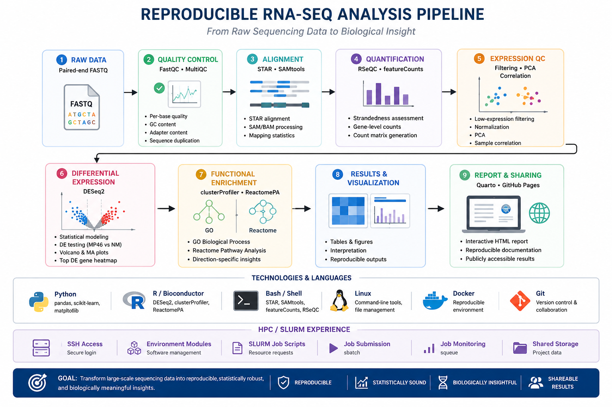

<div align="center">

# 🧬 Reproducible RNA-Seq Analysis Pipeline

### Large-Scale Sequencing Data → Reproducible Analysis → Biological Insight

An end-to-end bulk RNA-seq portfolio project demonstrating **Python, R,
Shell/Bash, Linux, Docker, HPC/SLURM, statistical genomics, reproducible
computing, and scientific reporting**.

<br>

[](#technical-skills-demonstrated)
[](#technical-skills-demonstrated)
[](#technical-skills-demonstrated)
[](#technical-skills-demonstrated)
[](#reproducibility)
[](#hpc--slurm-experience)
[](https://ArchanaAllishe.github.io/reproducible-rnaseq-pipeline/)
[](https://ArchanaAllishe.github.io/reproducible-rnaseq-pipeline/)

<br>

### 🔬 [View the Interactive RNA-Seq Analysis Report](https://ArchanaAllishe.github.io/reproducible-rnaseq-pipeline/)

`Python` · `R/Bioconductor` · `Bash` · `Linux` · `Docker` · `HPC/SLURM` ·
`STAR` · `featureCounts` · `DESeq2` · `Git` · `Quarto`

</div>

---

## Technical Skills Demonstrated

This project combines **bioinformatics analysis, scientific programming,
Linux-based data processing, reproducible computing, HPC workflow concepts,
and scientific communication**.

| Area | Technologies and Application |
|---|---|
| **Python** | `pandas`, `scikit-learn`, `matplotlib`, `pathlib`, `re` — count-matrix processing, QC, filtering, normalization, PCA, sample correlation, gene annotation, and visualization |
| **R / Bioconductor** | `DESeq2`, `clusterProfiler`, `ReactomePA` — differential expression, statistical modeling, GO enrichment, and Reactome pathway analysis |
| **Shell / Bash** | FASTQ/BAM handling, STAR execution, SAMtools, featureCounts, RSeQC, Docker, Git, batch processing, and troubleshooting |
| **Linux** | filesystem management, permissions, command-line bioinformatics, software environments, and large sequencing-file handling |
| **HPC / SLURM** | SSH-based cluster access, shared storage, environment modules, SLURM job scripts, resource requests, job submission, monitoring, and output review |
| **RNA-Seq / NGS** | QC, alignment, strandedness assessment, gene quantification, filtering, normalization, expression QC, differential expression, and functional interpretation |
| **Containers** | Docker — reproducible Linux/ARM64 bioinformatics environment |
| **Version Control** | Git, GitHub |
| **Scientific Reporting** | Quarto, Markdown, GitHub Pages |

---

## Workflow Overview

<p align="center">
  
</p>

The workflow connects raw sequencing data to biological interpretation and
shareable results while keeping the computational environment, scripts,
technical decisions, and reporting reproducible.

---

## Why This Project?

Modern biological research increasingly depends on the ability to transform
large-scale sequencing data into reliable and biologically meaningful
information.

RNA-seq analysis is not simply a sequence of software commands. A complete
analysis requires understanding how raw sequencing data move through:

```text
quality assessment
        ↓
alignment
        ↓
gene quantification
        ↓
sample-level QC
        ↓
statistical analysis
        ↓
functional interpretation
        ↓
scientific communication
```

This project was developed using a public RNA-seq dataset to demonstrate an
**end-to-end computational biology workflow** and to showcase the ability to
turn large-scale sequencing data into **quality-controlled, statistically
supported, biologically interpretable, and shareable results**.

The project demonstrates the ability to:

- work with large sequencing datasets
- evaluate data quality before drawing biological conclusions
- connect multiple bioinformatics tools into a coherent workflow
- make and document analytical decisions rather than relying blindly on defaults
- validate gene-count matrices before statistical testing
- assess replicate consistency and potential sample outliers
- use Python, R, Bash, and Linux for reproducible analysis
- perform statistically controlled differential-expression analysis
- translate gene-level differences into pathway-level biological patterns
- use Docker and Git to improve reproducibility
- work with HPC/SLURM-style execution environments
- organize code, documentation, data, and results appropriately
- communicate results through clear figures and an interactive report

The objective is not simply to generate computational output, but to
demonstrate how **large-scale biological data can be transformed into
meaningful scientific insight**.

---

## HPC / SLURM Experience

This project also includes hands-on experience with a **simulated HPC
environment** designed to reflect how institutional bioinformatics workflows
are commonly executed.

Work completed includes:

```text
SSH-based login to an HPC node
shared project storage
Linux users and groups
project permissions
environment modules
bioinformatics software modules
SLURM job scripts
CPU / memory / time requests
job submission with sbatch
job monitoring with squeue
job-output review
```

Example execution model:

```text
Login node
    ↓
Load software modules
    ↓
Prepare SLURM job script
    ↓
Request CPU / memory / runtime
    ↓
Submit with sbatch
    ↓
Monitor with squeue
    ↓
Review job output
```

The HPC environment was used to practice how reproducible bioinformatics
workflows move beyond a local workstation into shared compute infrastructure.

The next project phase will integrate this with **Nextflow + SLURM** for
automated workflow execution.

---

## Interactive Analysis Report

The complete results are available as a collaborator-facing **Quarto HTML
report**:

### 🔬 [Open the Interactive RNA-Seq Analysis Report](https://ArchanaAllishe.github.io/reproducible-rnaseq-pipeline/)

The report includes:

- sequencing and alignment QC
- count-matrix processing
- PCA
- sample-correlation analysis
- differential expression
- volcano plot
- MA plot
- top-DE-gene heatmap
- GO Biological Process enrichment
- Reactome pathway enrichment
- biological interpretation

---

## Project at a Glance

| Metric | Result |
|---|---:|
| Samples analyzed | **6** |
| Experimental groups | **2** |
| Unique mapping rate | **88.3–95.2%** |
| Initial genes | **78,894** |
| Genes retained after filtering | **12,728** |
| Variance explained by PC1 | **88.79%** |
| Variance explained by PC1 + PC2 | **92.52%** |
| Significant DE genes | **6,816** |
| Higher in MP46 | **3,495** |
| Higher in NM | **3,321** |
| GO BP terms — MP46 | **31** |
| GO BP terms — NM | **236** |
| Reactome pathways — MP46 | **0** |
| Reactome pathways — NM | **46** |

---

## Dataset

Publicly available bulk RNA-seq data from:

**GEO accession: GSE199679**

Six paired-end samples were analyzed:

| Group | Samples |
|---|---|
| **NM** | NM_4, NM_5, NM_6 |
| **MP46** | MP46_1, MP46_2, MP46_3 |

Primary comparison:

```text
MP46 vs NM
```

### Reference

| Component | Reference |
|---|---|
| Genome | GRCh38 primary assembly |
| Annotation | GENCODE v48 |

The same annotation release was maintained across genome indexing,
gene-level quantification, and downstream gene annotation.

---

# Key Results

## Sequencing QC and Alignment

Raw reads were evaluated using **FastQC**, and individual reports were
aggregated with **MultiQC**.

Reads were aligned to GRCh38 using **STAR**.

| Sample | Uniquely Mapped Reads |
|---|---:|
| NM_4 | 95.20% |
| NM_5 | 95.16% |
| NM_6 | 95.11% |
| MP46_1 | 88.29% |
| MP46_2 | 94.31% |
| MP46_3 | 89.23% |

Unique mapping ranged from approximately **88.3% to 95.2%**.

---

## Library Strandedness

Library orientation was not assumed.

It was empirically assessed using:

```text
RSeQC infer_experiment.py
```

The results supported a **reverse-stranded paired-end library**.

featureCounts was therefore configured with:

```text
-s 2
```

---

## Gene Quantification and Count QC

Gene-level counts were generated using **featureCounts**.

Initial matrix:

```text
78,894 genes
```

Low-expression filtering criterion:

```text
Retain genes with ≥10 counts in at least 3 samples
```

| Metric | Result |
|---|---:|
| Genes before filtering | 78,894 |
| Genes retained | **12,728** |
| Genes removed | 66,166 |
| Duplicate gene IDs | **0** |
| Missing values | **0** |
| Negative counts | **0** |

The validated 12,728-gene matrix was carried forward.

---

## Expression-Level QC

Expression-level QC was performed before differential-expression analysis.

Median-of-ratios normalization was used for exploratory analysis, followed by
log2 transformation for PCA and sample correlation.

Raw integer counts were retained separately for DESeq2.

### PCA

```text
PC1 = 88.79%
PC2 =  3.73%

PC1 + PC2 = 92.52%
```

PC1 clearly separated NM and MP46.

### Sample Correlation

Within-group correlations were high:

```text
NM    ≈ 0.96
MP46  ≈ 0.96–0.98
```

Between-group correlations were substantially lower:

```text
≈ 0.56–0.64
```

PCA and correlation analysis supported strong replicate consistency, and no
obvious expression-level outlier was identified.

📊 **[View expression QC figures](https://ArchanaAllishe.github.io/reproducible-rnaseq-pipeline/#expression-level-qc)**

---

## Differential Expression

Differential expression was performed using **DESeq2**.

```text
Design   : ~ Group
Contrast : MP46 vs NM
```

Contrast interpretation:

```text
log2FoldChange > 0  → higher in MP46
log2FoldChange < 0  → higher in NM
```

Primary significance threshold:

```text
adjusted p-value < 0.05
AND
|log2FoldChange| ≥ 1
```

| Result | Genes |
|---|---:|
| Genes tested | 12,728 |
| padj < 0.05 | 8,501 |
| **Significant DE genes** | **6,816** |
| Higher in MP46 | **3,495** |
| Higher in NM | **3,321** |
| padj < 0.05 and \|log2FC\| ≥ 2 | 3,200 |

Results were evaluated using:

- volcano plot
- MA plot
- top-30 DE-gene heatmap
- annotated DESeq2 tables

📈 **[View differential-expression results](https://ArchanaAllishe.github.io/reproducible-rnaseq-pipeline/#differential-expression)**

---

## Functional Enrichment

Significant DE genes were separated by expression direction:

```text
Higher in MP46 → 3,495 genes
Higher in NM   → 3,321 genes
```

Each set was independently analyzed using:

- **GO Biological Process**
- **Reactome**

The enrichment background consisted of genes **tested in DESeq2** rather than
all annotated human genes.

| Gene Set | GO BP | Reactome |
|---|---:|---:|
| Higher in MP46 | **31** | **0** |
| Higher in NM | **236** | **46** |

### Higher in MP46

Prominent themes included:

- cell and nuclear division
- microtubule organization
- centrosome-associated processes
- organelle fission

### Higher in NM

Prominent themes included:

- extracellular matrix organization
- cell adhesion
- antigen processing and presentation
- interferon-associated signaling
- extracellular matrix remodeling

No Reactome pathway passed the predefined threshold for the MP46-higher gene
set. This result was retained rather than changing the statistical threshold
after viewing the results.

🧬 **[View functional-enrichment results](https://ArchanaAllishe.github.io/reproducible-rnaseq-pipeline/#functional-enrichment)**

---

## Biological Summary

Multiple independent analyses consistently distinguished the two transcriptomic
groups:

```text
PCA
 │
 └── Strong NM / MP46 separation
             │
             ▼
Sample Correlation
 │
 └── High within-group consistency
             │
             ▼
DESeq2
 │
 └── 6,816 significant DE genes
             │
             ▼
Functional Enrichment
 │
 └── Distinct direction-specific signatures
```

Genes higher in **MP46** were associated mainly with cell-division and
microtubule-related processes.

Genes higher in **NM** showed broader extracellular-matrix, adhesion,
immune-associated, and antigen-processing signatures.

> **Interpretation note:** These findings represent expression-associated
> biological signatures. They are not interpreted as direct evidence of
> biological mechanism without additional experimental context.

---

## Analytical Decisions

<details>
<summary><b>Why use the same genome annotation throughout the analysis?</b></summary>

GRCh38 and GENCODE v48 were maintained consistently across STAR indexing,
featureCounts quantification, and downstream gene annotation.

This reduces coordinate and identifier inconsistencies between analysis stages.

</details>

<details>
<summary><b>Why determine strandedness empirically?</b></summary>

Incorrect strandedness can substantially alter gene-level quantification.

RSeQC was therefore used before configuring featureCounts.

</details>

<details>
<summary><b>Why filter low-expression genes?</b></summary>

Very low-count genes contribute limited statistical information while
increasing the multiple-testing burden.

The predefined criterion was:

```text
≥10 counts in at least 3 samples
```

</details>

<details>
<summary><b>Why perform PCA and correlation before DESeq2?</b></summary>

Sample-level QC was performed first to evaluate replicate consistency, group
structure, and potential outliers before interpreting statistical results.

</details>

<details>
<summary><b>Why separate enrichment by expression direction?</b></summary>

Genes higher in MP46 and genes higher in NM represent opposite expression
patterns.

Analyzing them separately preserves direction-specific biological
interpretation.

</details>

<details>
<summary><b>Why use DESeq2-tested genes as the enrichment background?</b></summary>

Only genes tested in the statistical analysis could enter the significant
gene lists.

The tested-gene universe therefore provides a more appropriate background than
all annotated genes.

</details>

<details>
<summary><b>Why retain zero significant Reactome pathways for MP46?</b></summary>

No Reactome pathways passed the predefined significance threshold.

The threshold was not relaxed after observing the result, preserving the
original analytical criteria.

</details>

---

## Reproducibility

The project separates the major components of computational analysis:

```text
Analysis code
     └── Git / GitHub

Computational environment
     └── Docker

Large sequencing data
     └── Outside Git

Technical methods
     └── docs/

Selected results
     └── results/

Scientific communication
     └── Quarto + GitHub Pages
```

### Why Docker?

STAR and associated command-line bioinformatics tools were executed in a
**Linux ARM64 Docker environment**.

Docker was used to:

- isolate bioinformatics dependencies
- provide a consistent Linux environment
- reduce host-specific software conflicts
- support execution on Apple Silicon
- make the environment easier to reproduce

---

## Repository Structure

```text
reproducible-rnaseq-pipeline/
│
├── assets/
│   └── rnaseq-workflow-overview.png
│
├── containers/
│   └── star/
│
├── scripts/
│   ├── downstream/
│   ├── differential-expression/
│   └── functional-enrichment/
│
├── docs/
│
├── results/
│   ├── qc/
│   ├── expression-qc/
│   ├── differential-expression/
│   └── functional-enrichment/
│
├── report/
│   ├── _quarto.yml
│   ├── index.qmd
│   ├── styles.css
│   └── images/
│
├── .gitignore
├── LICENSE
└── README.md
```

Large files are intentionally excluded from version control, including FASTQ,
BAM, reference genomes, STAR indexes, and large intermediate result tables.

---

## Project Status

### ✅ Completed

- [x] Raw paired-end FASTQ processing
- [x] FastQC and MultiQC
- [x] STAR alignment
- [x] empirical strandedness assessment
- [x] featureCounts quantification
- [x] count-matrix cleaning and QC
- [x] low-expression filtering
- [x] normalization
- [x] PCA
- [x] sample correlation
- [x] DESeq2 differential expression
- [x] gene annotation
- [x] volcano plot
- [x] MA plot
- [x] top-DE-gene heatmap
- [x] GO Biological Process enrichment
- [x] Reactome enrichment
- [x] Dockerized STAR environment
- [x] Git-based version control
- [x] technical workflow documentation
- [x] Quarto HTML report
- [x] GitHub Pages deployment
- [x] simulated HPC environment
- [x] environment modules
- [x] SLURM job submission and monitoring

---

## Next Development

The next phase will convert the validated analysis steps into an automated
workflow using **Nextflow**.

Planned development includes:

- [ ] Nextflow workflow automation
- [ ] end-to-end containerized execution
- [ ] configurable paired-end and single-end inputs
- [ ] automated QC and HTML report generation
- [ ] full RNA-seq execution through HPC / SLURM
- [ ] workflow testing
- [ ] continuous integration

The goal is to evolve the validated analysis into a **portable, automated,
containerized, and reproducible RNA-seq workflow** that can move between local
and HPC computing environments.

---

## What This Project Demonstrates

### 🧬 Computational Biology

Working from raw sequencing data through QC, expression analysis, statistical
testing, functional enrichment, and biological interpretation.

### 💻 Bioinformatics Engineering

Using Linux, Python, R, Bash, Docker, Git, HPC/SLURM concepts, reproducible
environments, and workflow-oriented project organization.

### 📊 Scientific Communication

Transforming complex analysis outputs into understandable figures, summaries,
biological interpretations, and an interactive report.

Together, these demonstrate the ability to **work with large-scale biological
data, evaluate it critically, build reproducible computational analyses,
identify biologically meaningful patterns, and communicate the resulting
insights clearly**.

---

<div align="center">

## Explore the Complete Analysis

### 🔬 [View the Interactive RNA-Seq Analysis Report](https://ArchanaAllishe.github.io/reproducible-rnaseq-pipeline/)

**Large-Scale Sequencing Data → Reproducible Analysis → Biological Insight → Shareable Results**

</div>