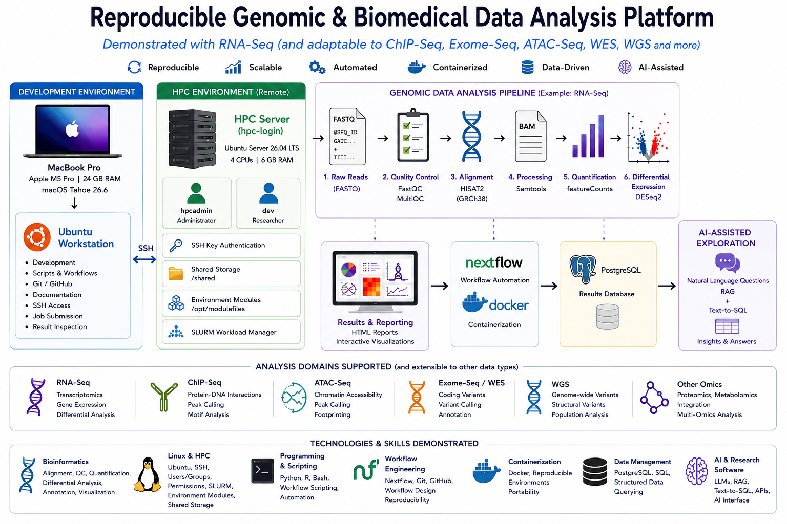

# Reproducible Genomic & Biomedical Data Analysis Platform

**A reproducible computational platform for genomic and biomedical data analysis, demonstrated through an end-to-end RNA-seq workflow and designed for extension to ChIP-seq, ATAC-seq, Exome-seq, WES/WGS, multi-omics, and other sequencing applications.**



## Skills Demonstrated

**Bioinformatics:** RNA-seq, NGS, FASTQ, FastQC, MultiQC, HISAT2, STAR, Samtools, featureCounts, DESeq2, GRCh38, GTF annotations, differential expression

**Linux & HPC:** Ubuntu, SSH, Linux users/groups, permissions, shared storage, Environment Modules, SLURM, batch computing, resource management

**Programming & Data:** Python, R, Bash, SQL, PostgreSQL

**Workflow Engineering:** Git, GitHub, Nextflow, Docker, workflow automation, containerization, reproducible computing

**Research Software & AI:** HTML reporting, APIs, LLMs, RAG, Text-to-SQL, natural-language data exploration

---

## Project Overview

Modern genomic analysis involves more than running individual bioinformatics tools.

A reproducible analysis environment must integrate:

```text
Scientific Data
      │
      ▼
Linux / HPC Infrastructure
      │
      ▼
Bioinformatics Analysis
      │
      ▼
Statistical Analysis
      │
      ▼
Results & Reporting
      │
      ▼
Workflow Automation
      │
      ▼
Structured Data Management
      │
      ▼
AI-Assisted Exploration
```

This project builds that environment incrementally.

**RNA-seq is used as the first end-to-end demonstration workflow.**

The same infrastructure and software-engineering principles are designed to support additional genomic workflows such as:

```text
RNA-Seq
ChIP-Seq
ATAC-Seq
Exome-Seq / WES
WGS
Multi-Omics
Other NGS workflows
```

Each data type requires its own scientifically appropriate tools and analysis methods; the goal is to reuse the underlying infrastructure, automation, reproducibility, and reporting framework.

---

# Platform Architecture

```text
                       macOS Host
                           │
                           ▼
                   Ubuntu Workstation
                           │
                           │ SSH
                           ▼
                     Simulated HPC
                           │
              ┌────────────┼────────────┐
              │            │            │
              ▼            ▼            ▼
          SLURM        Shared Data    Modules
              │
              └────────────┬────────────┘
                           ▼
                  Genomic Data Analysis
                           │
                           ▼
                  Results & Reporting
                           │
                           ▼
                  Nextflow + Docker
                           │
                           ▼
                     PostgreSQL
                           │
                           ▼
                 AI-Assisted Exploration
```

The architecture separates development, scheduled computation, workflow execution, data management, and researcher-facing results.

---

# Development Environment

The platform is hosted on an **Apple M5 Pro MacBook Pro with 24 GB memory and macOS Tahoe 26.6** using UTM virtualization.

Two Linux environments reproduce a typical research-computing workflow:

```text
Ubuntu Workstation
        │
        │ SSH
        ▼
Simulated HPC
        │
        │ SLURM
        ▼
Scheduled Analysis
```

## Ubuntu Workstation

The Ubuntu workstation provides the **development and access environment**.

It is used for:

- script and workflow development;
- Python, R, and Bash programming;
- Git/GitHub;
- documentation;
- SSH access;
- job submission;
- result inspection.

Configuration:

```text
Ubuntu 26.04 LTS
Architecture: aarch64
CPUs: 6
Memory: ~11 GiB
Swap: 4 GiB
Root filesystem: 146 GB
```

## Simulated HPC

The second Linux VM represents a **shared institutional computing environment**.

It provides:

- remote SSH access;
- administrator and researcher accounts;
- shared research storage;
- Linux permissions and groups;
- Environment Modules;
- SLURM scheduling;
- CPU and memory allocation;
- batch-job execution.

Configuration:

```text
Hostname: hpc-login
Ubuntu Server 26.04 LTS
Architecture: aarch64
CPUs: 4
Memory: 6 GB
Virtual disk: 64 GB
```

This reproduces the workflow:

```text
Develop
   ↓
Connect
   ↓
Submit
   ↓
Schedule
   ↓
Compute
   ↓
Review Results
```

---

# HPC Environment

## User Roles

Two account roles separate system administration from research computing:

```text
hpcadmin
    └── system administration

dev
    └── research computing
```

The `hpcadmin` account manages infrastructure and software.

The `dev` account performs analyses and submits computational jobs.

---

## SSH

SSH key authentication provides workstation-to-HPC access:

```text
Ubuntu Workstation
       │
       │ SSH
       ▼
dev@hpc-login
```

Connection:

```bash
ssh hpc-login
```

---

## Shared Research Storage

The HPC environment uses:

```text
/shared/
├── data/
├── projects/
└── reference/
```

Purpose:

```text
/shared/data
    → sequencing datasets

/shared/projects
    → project scripts, logs, metadata, and results

/shared/reference
    → genomes, annotations, and indexes
```

The current demonstration workspace is:

```text
/shared/projects/reproducible-rnaseq-pipeline/
```

A `bioinformatics` Linux group provides controlled collaborative access.

---

# SLURM Workload Management

SLURM manages computational workloads.

Current simulated configuration:

```text
Cluster: local-hpc
Partition: compute
Node: hpc-login
CPUs: 4
RealMemory: 5386 MB
```

A test batch job successfully demonstrated:

- job submission;
- CPU allocation;
- memory requests;
- scheduler execution;
- SLURM environment variables;
- output-file generation.

Example:

```bash
sbatch hello-hpc.sh
```

Validated output:

```text
Hello from SLURM
User: dev
Host: hpc-login
Job ID: 1
CPUs: 1
```

The computational model is:

```text
Researcher
    │
    │ sbatch
    ▼
  SLURM
    │
    ▼
Allocated Resources
    │
    ▼
Analysis
    │
    ▼
Results
```

---

# Environment Modules

Bioinformatics software is centrally managed through Environment Modules.

Module location:

```text
/opt/modulefiles
```

Currently configured:

```text
fastqc/0.12.1
multiqc/1.21
samtools/1.22.1
star/2.7.11b
```

Example:

```bash
module purge
module load fastqc/0.12.1
```

Modules provide:

- explicit software versions;
- reproducible environments;
- reduced dependency conflicts;
- centralized software management;
- integration with SLURM jobs.

Additional tools are added as new analysis workflows are implemented.

---

# Demonstration Workflow: RNA-Seq

RNA-seq is the first complete genomic workflow implemented on the platform.

It demonstrates the progression from raw sequencing data to biological interpretation.

```text
Public RNA-Seq Dataset
        │
        ▼
Sample Metadata
        │
        ▼
Paired-End FASTQ
        │
        ▼
FastQC
        │
        ▼
MultiQC
        │
        ▼
HISAT2 + GRCh38
        │
        ▼
Samtools
        │
        ▼
Sorted / Indexed BAM
        │
        ▼
featureCounts
        │
        ▼
Gene Count Matrix
        │
        ▼
DESeq2
        │
        ├── Normalization
        ├── PCA
        ├── Differential Expression
        └── Visualization
        │
        ▼
Biological Interpretation
        │
        ▼
HTML Report
```

---

# RNA-Seq Alignment Strategy

RNA-seq requires splice-aware alignment because reads may span exon-exon junctions.

Several alignment and quantification approaches were considered:

| Tool | Approach | Typical Application | Memory |
|---|---|---|---:|
| STAR | Splice-aware genome alignment | RNA-seq | High |
| HISAT2 | Splice-aware genome alignment | RNA-seq | Lower |
| Salmon | Transcript quantification | RNA-seq | Lower |
| kallisto | Transcript quantification | RNA-seq | Lower |
| Bowtie2 | Genome alignment | ChIP-seq / ATAC-seq | Lower |
| BWA | Genome alignment | WES / WGS | Lower |

## Selected RNA-Seq Aligner: HISAT2

HISAT2 provides:

```text
Splice-aware alignment       ✓
Paired-end support           ✓
Human genome alignment       ✓
SAM/BAM workflow             ✓
Samtools compatibility       ✓
featureCounts compatibility  ✓
Lower memory requirement     ✓
```

The selected workflow is:

```text
FASTQ
  ↓
HISAT2
  ↓
Samtools
  ↓
BAM
  ↓
featureCounts
```

STAR remains available for higher-memory computing environments.

Detailed evaluation:

```text
docs/07-rnaseq-alignment-tools-and-workflow-selection.md
```

---

# RNA-Seq Reference Genome

Planned reference configuration:

```text
Genome:      GRCh38
Aligner:     HISAT2
Index:       Prebuilt GRCh38 HISAT2 index
Annotation:  Compatible GTF annotation
```

The exact genome and annotation releases will be recorded for reproducibility.

---

# RNA-Seq Demonstration Dataset

The project is currently evaluating:

```text
GSE199679
```

Before downloading the sequencing data, the study will be verified for:

- sample identities;
- experimental groups;
- biological replicates;
- SRA run accessions;
- sequencing layout;
- read lengths;
- FASTQ sizes;
- storage requirements.

The dataset will be finalized after both the experimental design and computational requirements are confirmed.

---

# Quality Control

FastQC evaluates raw sequencing quality, including:

- per-base quality;
- sequence quality distributions;
- GC content;
- duplication;
- adapters;
- overrepresented sequences.

MultiQC combines results across samples:

```text
FastQC Sample 1 ──┐
FastQC Sample 2 ──┤
FastQC Sample 3 ──┤
                  ├── MultiQC
FastQC Sample N ──┘
                       │
                       ▼
                Combined QC Report
```

---

# Alignment Processing

Samtools processes alignment output:

```text
HISAT2
   ↓
SAM
   ↓
BAM
   ↓
Sort
   ↓
Index
   ↓
Alignment QC
```

Intermediate files will be managed to reduce unnecessary storage usage.

---

# Gene Quantification

featureCounts assigns aligned fragments to annotated genes.

```text
Sorted BAM
    +
GTF Annotation
      │
      ▼
featureCounts
      │
      ├── counts.txt
      └── counts.txt.summary
```

Raw integer counts are retained for downstream statistical analysis.

---

# Differential Expression

DESeq2 will perform:

- count import;
- metadata integration;
- normalization;
- sample QC;
- PCA;
- differential-expression testing;
- multiple-testing correction;
- visualization.

Planned outputs include:

```text
PCA
Sample correlations
MA plots
Volcano plots
Heatmaps
Differential-expression tables
Pathway analysis
```

---

# Results & Reporting

A major platform goal is to transform analysis outputs into **researcher-facing results**.

The RNA-seq workflow will generate a browser-accessible HTML report containing:

- study description;
- experimental design;
- sample metadata;
- sequencing information;
- QC results;
- alignment statistics;
- quantification statistics;
- PCA;
- differential expression;
- visualizations;
- biological interpretation;
- methods;
- software versions.

The goal is:

```text
Pipeline Output Files
        ↓
Integrated Analysis
        ↓
Interactive HTML Report
        ↓
Collaborator / Researcher
```

---

# Extending the Platform to Other Genomic Data

RNA-seq demonstrates the platform first, but the architecture is designed for additional genomic workflows.

## ChIP-Seq

Potential workflow:

```text
FASTQ
  ↓
FastQC / MultiQC
  ↓
Bowtie2
  ↓
Samtools
  ↓
Peak Calling
  ↓
Peak Annotation
  ↓
Motif / Functional Analysis
  ↓
HTML Report
```

Demonstrates:

- protein-DNA interaction analysis;
- peak calling;
- genomic annotation;
- motif analysis.

---

## ATAC-Seq

Potential workflow:

```text
FASTQ
  ↓
QC
  ↓
Alignment
  ↓
Filtering
  ↓
Peak Calling
  ↓
Chromatin Accessibility
  ↓
Motif / Footprinting Analysis
  ↓
HTML Report
```

Demonstrates chromatin-accessibility analysis and regulatory-element identification.

---

## Exome-Seq / WES

Potential workflow:

```text
FASTQ
  ↓
QC
  ↓
Alignment
  ↓
BAM Processing
  ↓
Variant Calling
  ↓
Variant Filtering
  ↓
Annotation
  ↓
Interpretation
```

Demonstrates coding-region variant analysis.

---

## WGS

The platform can also be extended to whole-genome sequencing workflows involving:

- genome alignment;
- variant calling;
- filtering;
- annotation;
- structural-variant analysis;
- reproducible genomic reporting.

---

# Workflow Automation with Nextflow

Once the individual RNA-seq stages are validated, the workflow will be converted into a Nextflow pipeline.

```text
                 Nextflow
                    │
       ┌────────────┼────────────┐
       ▼            ▼            ▼
      QC        Alignment    Processing
       │            │            │
       └────────────┼────────────┘
                    ▼
               Quantification
                    │
                    ▼
                 Analysis
                    │
                    ▼
                 Report
```

Nextflow will provide:

- workflow orchestration;
- parallelization;
- dependency handling;
- resumability;
- reproducible configuration;
- local execution;
- SLURM execution.

Planned profiles:

```bash
nextflow run main.nf -profile local
```

```bash
nextflow run main.nf -profile slurm
```

As additional genomic workflows are implemented, the same workflow-engineering principles can be applied to each data type.

---

# Containerization with Docker

Docker will provide portable, version-controlled analysis environments.

The project demonstrates two complementary software-management approaches:

```text
Institutional HPC
      │
      ▼
Environment Modules
```

and:

```text
Portable Workflow
      │
      ▼
Docker Containers
```

The longer-term architecture combines:

```text
Nextflow
   +
Docker
   +
SLURM
```

to support reproducible execution across local and HPC environments.

---

# Structured Results with PostgreSQL

Processed analysis results will eventually be organized into PostgreSQL.

For RNA-seq, potential tables include:

```text
samples
genes
gene_counts
differential_expression
pathway_results
qc_metrics
```

Future genomic workflows can introduce additional structured results such as:

```text
variants
peaks
genomic_regions
annotations
motifs
accessibility_results
```

This creates a common structured data layer across different genomic analyses.

---

# AI-Assisted Data Exploration

A future platform layer will provide natural-language access to processed research data.

```text
Researcher
     │
     ▼
Natural-Language Question
     │
     ▼
LLM Interface
     │
 ┌───┴─────────┐
 ▼             ▼
RAG        Text-to-SQL
 │             │
 ▼             ▼
Project     PostgreSQL
Knowledge    Results
 │             │
 └──────┬──────┘
        ▼
 Insights & Answers
```

## AI-Assisted Chat Interface

Example RNA-seq questions:

```text
Which genes are significantly upregulated?

Show genes with adjusted p-value < 0.05 and log2 fold change > 2.

Which pathways are enriched?

Which samples had QC issues?
```

Future genomic workflows could support questions such as:

```text
Which genes are associated with the strongest ChIP-seq peaks?

Which regulatory regions show increased ATAC-seq accessibility?

Which high-impact coding variants were detected in the exome data?
```

Planned technologies:

```text
Python
PostgreSQL
SQL
LLMs
RAG
Text-to-SQL
APIs
```

The AI layer will operate on validated computational results rather than replace the underlying bioinformatics analysis.

---

# Future Clinical Research Data Adaptation

The same data-access architecture can later be adapted to appropriately governed clinical research datasets.

**Concept: AI-Assisted Chat Interface for Clinical Research Data**

Researchers frequently depend on data analysts to retrieve information from complex structured datasets. A conversational interface using RAG and Text-to-SQL could allow authorized users to query appropriate research datasets using natural language.

Potential benefits include:

- self-service data exploration;
- reduced repetitive analyst requests;
- shorter query turnaround time;
- faster hypothesis generation;
- improved access to research-data resources.

Any clinical implementation would require appropriate authorization, privacy protection, governance, validation, auditing, and institutional security controls.

---

# Platform Evolution

```text
Linux / HPC Infrastructure
          │
          ▼
RNA-Seq Demonstration
          │
          ▼
Reproducible Reporting
          │
          ▼
Nextflow Automation
          │
          ▼
Docker Containerization
          │
          ▼
Additional Genomic Workflows
   ┌──────┼──────┬────────┐
   ▼      ▼      ▼        ▼
ChIP-Seq ATAC-Seq WES    WGS
   └──────┼──────┴────────┘
          ▼
Structured Results Database
          │
          ▼
AI-Assisted Data Exploration
```

---

# Project Roadmap

## Phase 1 — Research Computing Infrastructure

- [x] Ubuntu workstation
- [x] Simulated HPC environment
- [x] SSH authentication
- [x] Shared research storage
- [x] Linux users/groups and permissions
- [x] SLURM workload management
- [x] Environment Modules

## Phase 2 — RNA-Seq Demonstration

- [x] Alignment strategy and tool evaluation
- [ ] Dataset validation and acquisition
- [ ] Raw-read quality control
- [ ] HISAT2 alignment
- [ ] Alignment processing and QC
- [ ] Gene quantification
- [ ] Differential-expression analysis
- [ ] Biological interpretation
- [ ] HTML results report

## Phase 3 — Workflow Engineering

- [ ] Nextflow pipeline
- [ ] Docker containerization
- [ ] Local execution profile
- [ ] SLURM execution profile
- [ ] Automated reporting
- [ ] Reproducibility testing

## Phase 4 — Additional Genomic Workflows

- [ ] ChIP-seq workflow
- [ ] ATAC-seq workflow
- [ ] Exome-seq / WES workflow
- [ ] WGS workflow
- [ ] Multi-omics integration

## Phase 5 — Research Data Platform

- [ ] PostgreSQL results database
- [ ] Results API
- [ ] AI-assisted data interface
- [ ] RAG integration
- [ ] Text-to-SQL
- [ ] Validation and query auditing

---

# Documentation

Detailed implementation documentation is maintained in:

```text
docs/
```

Current documentation includes:

```text
01 — Ubuntu Environment
02 — Shared Project Workspace
03 — Git and Version Control
04 — Simulated HPC Server Deployment
05 — SLURM Workload Management
06 — Environment Modules
07 — RNA-Seq Alignment Tools and Workflow Selection
```

The README provides the high-level platform overview.

Detailed commands, implementation decisions, troubleshooting, and validation are maintained in the corresponding documentation.

---

# Current Status

```text
Research Computing Infrastructure      COMPLETE
                ↓
RNA-Seq Workflow Design                COMPLETE
                ↓
RNA-Seq Dataset Validation             NEXT
                ↓
RNA-Seq Implementation
                ↓
HTML Reporting
                ↓
Nextflow + Docker
                ↓
Additional Genomic Workflows
                ↓
PostgreSQL Results Layer
                ↓
AI-Assisted Data Exploration
```

## Current Focus

**RNA-seq serves as the first end-to-end demonstration of the platform.**

The next step is to validate and acquire the selected public RNA-seq dataset, then execute the complete workflow from raw FASTQ files through differential-expression analysis and reproducible reporting.

The same infrastructure will subsequently be extended to additional genomic data types.

---

# License

See the `LICENSE` file for licensing information.