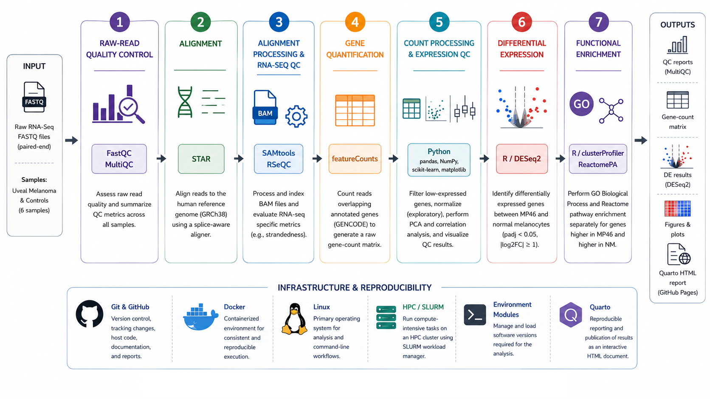

<div align="center">

# 🧬 Reproducible Bulk RNA-Seq Analysis Pipeline

### From Raw Sequencing Reads to Biological Insight


</div>

---

## Project Overview

Bioinformatics analysis involves more than running a series of tools. Raw
sequencing data need to be checked, processed, analyzed, interpreted, and
presented in a way that can be reproduced and reviewed.

This repository brings those pieces together using **bulk RNA-seq as an
end-to-end case study**.

The workflow starts with raw paired-end FASTQ files and continues through
sequencing quality control, read alignment, library strandedness assessment,
gene quantification, count-matrix QC, expression-level QC, differential
expression, functional enrichment, and biological interpretation.

The individual analysis stages were first developed and validated using
**Python, R/Bioconductor, and command-line bioinformatics tools**. They were
then connected with **Nextflow** to automate process dependencies and data flow.
**Docker** provides controlled software environments, while **Linux and
SLURM** demonstrate how the same workflow principles can be applied in an HPC
setting. Final results are organized into a **Quarto HTML report** for
interactive review and sharing.

Together, the project demonstrates both the biological analysis and the
computational infrastructure needed to make an RNA-seq workflow reproducible.


---

## Workflow Overview

<p align="center">
  
</p>

---
## Computing Environment

The workflow can be run on a local Linux workstation or, when available, on
an institutional High Performance Computing (HPC) system. An HPC cluster is typically accessed remotely
from a macOS, Windows, or Linux workstation using SSH. Analysis files and jobs
are prepared on the login node, while computational work is submitted to
compute nodes through a scheduler such as SLURM.

For this project, an Ubuntu-based HPC environment was also configured to
demonstrate shared storage, environment modules, SSH access, and SLURM job
submission. Docker provides reproducible software environments, while Nextflow
coordinates the analysis steps and reuses the resulting BAM files for the
automated downstream workflow.

---
## Requirements and Reproducibility

The analysis combines standard bioinformatics tools with workflow automation
and containerization. Individual analysis steps can be run manually, while the
automated workflow uses **Nextflow and Docker** to provide a more reproducible
execution environment.

| Tool | Purpose |
|---|---|
| FastQC | Raw-read quality assessment |
| MultiQC 1.35 | Combined sequencing QC report |
| STAR | RNA-seq read alignment |
| SAMtools | BAM processing and indexing |
| RSeQC | Library strandedness assessment |
| featureCounts | Gene-level quantification |
| R / DESeq2 | Differential-expression analysis |
| Python | Data processing and visualization |
| Nextflow | Workflow automation |
| Docker | Reproducible software environments |
| Quarto | Interactive results reporting |
| Git | Version control |
| SLURM | HPC job scheduling when available |

For the automated workflow, install **Nextflow**, **Docker**, and **Quarto**.
Bioinformatics software used by the workflow is provided through versioned
containers, reducing the need to install each tool separately.

```bash
nextflow -version
docker --version
quarto --version
```

The workflow can then be run with:

```bash
nextflow run workflow/main.nf \
    -c workflow/nextflow.config \
    -resume
```

On an institutional HPC system, software may instead be provided through
environment modules or container technologies supported by the cluster.
Detailed Linux, HPC, environment-module, and SLURM setup is documented in
[`docs/`](docs/).

---
# RNA-Seq Case Study

## From RNA to Sequencing Reads

RNA-seq is used to measure **gene expression**—which genes are active in a
biological sample and how strongly they are expressed.

Comparing RNA-seq profiles between biological groups can identify genes with
increased or decreased expression and reveal biological processes and pathways
associated with those differences.

RNA-seq begins with RNA extracted from biological samples. The RNA is converted
to cDNA, prepared as a sequencing library, and sequenced to generate millions
of reads stored in **FASTQ files**.

Sequencing can be:

- **Single-end** — one end of each fragment is sequenced, producing one FASTQ
  file per sample.
- **Paired-end** — both ends are sequenced, producing corresponding `R1` and
  `R2` FASTQ files.

Paired-end sequencing provides information from both ends of a fragment, which
can improve alignment and genomic placement.

This project uses **paired-end RNA-seq data**.

---

## RNA-Seq Dataset and Data Background

The analysis uses publicly available RNA-seq data from **GSE199679 /
GSE198801**, a study comparing normal uveal melanocytes with uveal melanoma.

**Uveal melanoma** is a malignant tumor that develops from melanocytes in the
uvea, the pigmented layer of the eye that includes the choroid, ciliary body,
and iris.

Two groups were analyzed:

- **NM (Normal Melanocytes)** — normal uveal/choroidal melanocytes used as the
  non-malignant reference group.
- **MP46** — a patient-derived xenograft (PDX) model of uveal melanoma,
  representing the malignant group.

The analysis included **six paired-end RNA-seq samples**, with **three
biological replicates per group**:

| Group | Biological context | Replicates |
|---|---|---|
| **NM** | Normal uveal melanocytes | NM_4, NM_5, NM_6 |
| **MP46** | Uveal melanoma PDX model | MP46_1, MP46_2, MP46_3 |

The primary comparison was therefore:

> **MP46 uveal melanoma vs. normal melanocytes (NM)**

The biological replicates provide independent measurements within each group,
allowing within-group consistency and between-group expression differences to
be evaluated.
```
---
# Analysis

The workflow processes paired-end RNA-seq data from sequencing QC through alignment, gene quantification, differential expression, functional enrichment, and reporting. Sample identifiers are retained throughout the analysis for traceability.

## Sample Naming

Each biological sample has two paired-end FASTQ files:

```text
<sample>_R1.fastq.gz
<sample>_R2.fastq.gz
```

For example:

```text
NM_4_R1.fastq.gz
NM_4_R2.fastq.gz
```

Here, `NM_4` is the sample identifier, while `R1` and `R2` are the paired sequencing reads.

The dataset contains **six samples with three biological replicates per group**:

| Group | Biological context | Samples |
|---|---|---|
| **NM** | Normal uveal melanocytes | NM_4, NM_5, NM_6 |
| **MP46** | Uveal melanoma PDX model | MP46_1, MP46_2, MP46_3 |

The sample identifier is preserved in downstream files:

```text
NM_4_R1/R2.fastq.gz
        ↓
       STAR
        ↓
NM_4_Aligned.sortedByCoord.out.bam
        ↓
  featureCounts
        ↓
   NM_4 counts
```

This makes each downstream result traceable to its original sample.
---

## 1. Sequencing Quality Control — FastQC and MultiQC

Raw FASTQ files were assessed before alignment.

**FastQC** evaluates individual sequencing files for metrics including
per-base sequence quality, GC content, duplication, adapter content, and
overrepresented sequences.

**MultiQC 1.35** combines the FastQC results into a single report so that QC
patterns can be compared across all sequencing files.

FastQC evaluates `R1` and `R2` independently:

```text
NM_4_R1.fastq.gz → FastQC → NM_4_R1_fastqc.html
NM_4_R2.fastq.gz → FastQC → NM_4_R2_fastqc.html
```

Experimental-group assignment is not required for this step.

### Manual execution

```bash
fastqc /path/to/fastq/*.fastq.gz
```

The FastQC outputs were summarized with:

```bash
multiqc . -o .
```

### Nextflow automation

The `FASTQC` and `MULTIQC` processes in
[`workflow/main.nf`](workflow/main.nf) automate the same analysis.

Nextflow uses `Channel.fromFilePairs()` to associate `R1` and `R2` files by
their shared sample identifier while FastQC continues to evaluate each FASTQ
file individually.

| Output | Purpose |
|---|---|
| `*_fastqc.html` | QC report for each FASTQ file |
| `*_fastqc.zip` | Machine-readable FastQC results |
| `multiqc_report.html` | Combined interactive sequencing-QC report |
| `multiqc_data/` | Structured MultiQC results |

<h2 align="center">
  <a href="https://archanaallishe.github.io/bioinformatics-analysis-workflows/multiqc_report.html">
    View Interactive MultiQC Report
  </a>
</h2>

---

## 2. Read Alignment — STAR

FASTQ files contain sequencing reads but do not indicate where those reads
originated in the genome.

**STAR** aligns paired-end RNA-seq reads to the human reference genome and
handles reads spanning exon-exon splice junctions.

```text
NM_4_R1.fastq.gz + NM_4_R2.fastq.gz
                  ↓
                 STAR
                  ↓
NM_4_Aligned.sortedByCoord.out.bam
```

The resulting **BAM** file stores genomic read alignments in a compact binary
format.

### Manual execution

STAR alignment was performed with:

[`scripts/alignment/run_star_all.sh`](scripts/alignment/run_star_all.sh)

```bash
bash scripts/alignment/run_star_all.sh
```

The script identifies matching `R1` and `R2` files, derives the sample ID from
their shared filename prefix, and generates sample-specific STAR outputs.

### Nextflow automation

STAR alignment is not repeated in the current downstream Nextflow workflow.
The workflow **reuses the resulting validated BAM files**.

| Output | Purpose |
|---|---|
| `*_Aligned.sortedByCoord.out.bam` | Coordinate-sorted read alignments |
| `*Log.final.out` | STAR alignment statistics |
| `*SJ.out.tab` | Detected splice junctions |

---

## 3. BAM Indexing — SAMtools

BAM files can contain millions of alignments. Reading the complete file every
time a genomic region is requested would be inefficient.

**SAMtools** creates a BAM index (`.bai`) that allows software to retrieve
specific genomic regions without scanning the complete BAM file.

```text
sample.bam
    ↓
samtools index
    ↓
sample.bam.bai
```

The BAM contains the alignments; the BAI acts as a lookup index for those
alignments.

### Manual execution

```bash
samtools index sample.bam
```

### Nextflow automation

The `SAMTOOLS_INDEX` process in
[`workflow/main.nf`](workflow/main.nf) automatically indexes each BAM entering
the workflow.

| Output | Purpose |
|---|---|
| `*.bam.bai` | Index enabling efficient access to the corresponding BAM |

---

## 4. Library Strandedness — RSeQC

RNA-seq library preparation determines whether read orientation preserves
information about the strand from which the RNA originated.

Libraries can be:

- **Unstranded** — read orientation does not reliably identify the transcript
  strand.
- **Forward-stranded** — read orientation follows the forward convention of
  the library-preparation protocol.
- **Reverse-stranded** — read orientation follows the opposite convention.

For paired-end RNA-seq, strandedness is determined from the relationship
between `R1`, `R2`, and annotated transcript orientation. It is not simply
whether every read maps to the same or opposite strand as a gene.

This matters because genes can overlap on opposite genomic strands. Using the
wrong strandedness during quantification can incorrectly assign or discard
reads.

**RSeQC `infer_experiment.py`** was used to infer the library orientation from
the aligned reads.

```text
BAM + reference gene annotation
              ↓
      infer_experiment.py
              ↓
      strandedness assessment
              ↓
      featureCounts setting
```

### Manual execution

```bash
infer_experiment.py \
    -r gencode.v48.bed \
    -i sample.bam \
    > sample_infer_experiment.txt
```

The assessment supported **reverse-stranded** quantification, so featureCounts
was run with:

```text
-s 2
```

where:

```text
-s 0 → unstranded
-s 1 → stranded
-s 2 → reversely stranded
```

### Nextflow automation

The `RSEQC_INFER_EXPERIMENT` process in
[`workflow/main.nf`](workflow/main.nf) performs the same assessment on BAM
files entering the workflow.

| Output | Purpose |
|---|---|
| `*_infer_experiment.txt` | Evidence used to determine library strandedness |

---

## 5. Gene Quantification — featureCounts

BAM files describe read alignments, but differential-expression analysis
requires a numerical count for each gene in each sample.

**featureCounts** assigns aligned fragments to annotated exons and summarizes
them at the gene level.

```text
BAM files + GENCODE GTF
          ↓
     featureCounts
          ↓
   Gene × Sample
     raw counts
```

Important settings were:

```text
-p                  paired-end data
--countReadPairs    count fragments/read pairs
-s 2                reverse-stranded library
-t exon             count annotated exons
-g gene_id          summarize at gene level
```

### Manual execution

The original quantification was performed with:

[`scripts/quantification/run_featurecounts.sh`](scripts/quantification/run_featurecounts.sh)

```bash
bash scripts/quantification/run_featurecounts.sh
```

The equivalent core command is:

```bash
featureCounts \
    -T 4 \
    -p \
    --countReadPairs \
    -s 2 \
    -t exon \
    -g gene_id \
    -a gencode.v48.primary_assembly.annotation.gtf \
    -o gene_counts.txt \
    *.bam
```

### Nextflow automation

The `FEATURECOUNTS` process in
[`workflow/main.nf`](workflow/main.nf) performs the same quantification.

Each BAM contributes one sample column to the count matrix.

| Output | Purpose |
|---|---|
| `gene_counts.txt` | Raw gene-level counts for all samples |
| `gene_counts.txt.summary` | Read-assignment statistics |

---

## 6. Count-Matrix Preparation and Filtering

featureCounts output contains genomic annotation fields in addition to sample
counts. These fields were removed and BAM-derived column names were converted
to concise sample identifiers.

Genes with very low expression provide little information for statistical
testing and increase the multiple-testing burden.

Genes were retained when they had:

```text
≥ 10 counts in at least 3 samples
```

```text
featureCounts output
        ↓
clean sample names
        ↓
gene × sample raw-count matrix
        ↓
low-expression filtering
        ↓
filtered raw counts
```

### Manual execution

Count-matrix cleaning:

```bash
python3 scripts/downstream/clean_featurecounts.py \
    gene_counts.txt \
    gene_counts_matrix.tsv
```

Low-expression filtering:

```bash
python3 scripts/downstream/filter_counts.py \
    gene_counts_matrix.tsv \
    gene_counts_filtered.tsv
```

### Nextflow automation

The corresponding processes in
[`workflow/main.nf`](workflow/main.nf) execute these scripts and pass the
resulting matrix directly to DESeq2.

| Output | Purpose |
|---|---|
| `gene_counts_matrix.tsv` | Clean gene-by-sample raw-count matrix |
| `gene_counts_filtered.tsv` | Filtered raw counts used by DESeq2 |

### Count-Matrix Summary

| Metric | Result |
|---|---:|
| Genes before filtering | 78,894 |
| Genes retained | **12,728** |
| Genes removed | 66,166 |
| Duplicate gene IDs | **0** |
| Missing values | **0** |
| Negative counts | **0** |

Raw integer counts are supplied to DESeq2. They are **not manually normalized
or log-transformed before DESeq2 modeling**.

---

## 7. Differential Expression — DESeq2

**DESeq2** models RNA-seq counts using a negative-binomial framework and
accounts for differences in sequencing depth and library composition.

Sample names in the count matrix are matched to metadata defining the
experimental groups.

```text
Design   : ~ Group
Contrast : MP46 vs NM
```

Fold-change direction is:

```text
log2FoldChange > 0 → higher in MP46
log2FoldChange < 0 → higher in NM
```

The predefined significance criterion used consistently throughout the
analysis is:

```text
adjusted p-value < 0.05
AND
|log2FoldChange| ≥ 1
```

`|log2FoldChange| ≥ 1` corresponds to at least a **2-fold expression
difference**.

### Manual execution

```bash
Rscript scripts/differential-expression/run_deseq2.R \
    gene_counts_filtered.tsv \
    samples.tsv \
    deseq2_results
```

Gene identifiers were then annotated from GENCODE:

```bash
python3 scripts/differential-expression/annotate_deseq2.py \
    gencode.v48.primary_assembly.annotation.gtf \
    deseq2_results/deseq2_MP46_vs_NM.tsv \
    deseq2_MP46_vs_NM_annotated.tsv
```

### Nextflow automation

The `RUN_DESEQ2` and `ANNOTATE_DESEQ2` processes in
[`workflow/main.nf`](workflow/main.nf) automate these steps and provide the
resulting files to visualization, expression-QC, and enrichment processes.

### Differential-Expression Summary

| Criterion | Genes |
|---|---:|
| Genes tested | 12,728 |
| padj < 0.05 | 8,501 |
| **padj < 0.05 and \|log2FC\| ≥ 1** | **6,816** |
| Higher in MP46 | **3,495** |
| Higher in NM | **3,321** |

| Output | Purpose |
|---|---|
| `deseq2_MP46_vs_NM.tsv` | DESeq2 statistics for all tested genes |
| `deseq2_MP46_vs_NM_significant.tsv` | Genes meeting the DE criteria |
| `deseq2_MP46_vs_NM_annotated.tsv` | DE results with gene annotation |
| `vst_expression.tsv` | Variance-stabilized expression values for QC and visualization |

<p align="center">
  <a href="https://archanaallishe.github.io/bioinformatics-analysis-workflows/#differential-expression">
    <strong>View Differential-Expression Results</strong>
  </a>
</p>

---

## 8. Expression-Level Quality Control

Sample relationships were assessed using **PCA** and **Pearson correlation**
on DESeq2 variance-stabilized expression values.

These analyses evaluate the overall relationship among samples rather than
testing individual genes.

### Principal Component Analysis

PCA summarizes the major sources of variation across the complete expression
dataset.

```text
PC1 = 88.79%
PC2 =  3.73%

PC1 + PC2 = 92.52%
```

PC1 clearly separated the NM and MP46 samples.

### Sample Correlation

Within-group correlations were high:

```text
NM    ≈ 0.96
MP46  ≈ 0.96–0.98
```

Between-group correlations were lower:

```text
≈ 0.56–0.64
```

Together, PCA and correlation show consistent replicates within each group and
substantial expression differences between NM and MP46.

### Manual execution

PCA:

```bash
python3 scripts/differential-expression/plot_pca.py \
    vst_expression.tsv \
    samples.tsv \
    pca_results
```

Sample correlation:

```bash
python3 scripts/downstream/sample_correlation.py \
    vst_expression.tsv \
    sample_correlation.tsv
```

Correlation heatmap:

```bash
python3 scripts/downstream/plot_correlation.py \
    sample_correlation.tsv \
    correlation_results
```

### Nextflow automation

The corresponding processes in
[`workflow/main.nf`](workflow/main.nf) automatically receive the
variance-stabilized expression matrix produced by DESeq2.

| Output | Purpose |
|---|---|
| `PCA_MP46_vs_NM.png/.pdf` | PCA visualization |
| `PCA_coordinates.tsv` | PCA coordinates for individual samples |
| `sample_correlation.tsv` | Pairwise Pearson correlations |
| `sample_correlation_heatmap.png/.pdf` | Visual sample-similarity assessment |

<p align="center">
  <a href="https://archanaallishe.github.io/bioinformatics-analysis-workflows/#expression-level-qc">
    <strong>View Expression-Level QC</strong>
  </a>
</p>

---

## 9. Differential-Expression Visualization

Three complementary visualizations were generated.

**Volcano plot** shows effect size against statistical significance.

**MA plot** shows expression change across the range of average gene
expression.

**Top-30 DE heatmap** shows expression patterns of the most statistically
significant differentially expressed genes across individual samples.

All DE classifications use the same criterion:

```text
padj < 0.05
AND
|log2FoldChange| ≥ 1
```

### Manual execution

Volcano plot:

```bash
python3 scripts/differential-expression/plot_volcano.py \
    deseq2_MP46_vs_NM_annotated.tsv \
    volcano_results
```

MA plot:

```bash
python3 scripts/differential-expression/plot_ma.py \
    deseq2_MP46_vs_NM_annotated.tsv \
    ma_results
```

Top-30 DE heatmap:

```bash
python3 scripts/differential-expression/plot_de_heatmap.py \
    deseq2_MP46_vs_NM_annotated.tsv \
    vst_expression.tsv \
    heatmap_results
```

### Nextflow automation

The `PLOT_VOLCANO`, `PLOT_MA`, and `PLOT_DE_HEATMAP` processes in
[`workflow/main.nf`](workflow/main.nf) automatically receive their required
DESeq2 outputs.

| Output | Purpose |
|---|---|
| `volcano_MP46_vs_NM.png/.pdf` | Effect size versus statistical significance |
| `MA_MP46_vs_NM.png/.pdf` | Fold change across expression abundance |
| `top30_DE_heatmap.png/.pdf` | Expression patterns of top DE genes |

---

## 10. Functional Enrichment

Differential expression identifies individual genes, while functional
enrichment asks whether groups of DE genes are associated with particular
biological processes or pathways.

Significant genes were separated by direction using the **same DE threshold**
used throughout the project:

```text
padj < 0.05 and log2FoldChange ≥  1 → Higher in MP46
padj < 0.05 and log2FoldChange ≤ -1 → Higher in NM
```

This produced:

```text
Higher in MP46 → 3,495 genes
Higher in NM   → 3,321 genes
```

The groups were independently analyzed using:

- **Gene Ontology Biological Process**
- **Reactome**

Genes tested by DESeq2 with available gene symbols were used as the enrichment
background rather than all annotated human genes.

### Manual execution

```bash
Rscript scripts/functional-enrichment/run_enrichment.R \
    deseq2_MP46_vs_NM_annotated.tsv \
    enrichment_results
```

Summary figures:

```bash
python3 scripts/functional-enrichment/plot_enrichment.py \
    enrichment_results \
    enrichment_plots
```

### Nextflow automation

The `FUNCTIONAL_ENRICHMENT` and `PLOT_ENRICHMENT` processes in
[`workflow/main.nf`](workflow/main.nf) execute these analyses and pass the
summary figures to the Quarto report.

### Enrichment Summary

| Gene Set | GO Biological Process | Reactome |
|---|---:|---:|
| Higher in MP46 | **31** | **0** |
| Higher in NM | **236** | **46** |

Genes higher in **MP46** were primarily associated with cell and nuclear
division, microtubule organization, centrosome-associated processes, and
organelle fission.

Genes higher in **NM** showed broader enrichment for extracellular-matrix
organization, cell adhesion, antigen processing and presentation,
interferon-associated signaling, and extracellular-matrix remodeling.

No Reactome pathway passed the predefined enrichment threshold for the
MP46-higher gene set. The statistical threshold was not relaxed after
observing this result.

<p align="center">
  <a href="https://archanaallishe.github.io/bioinformatics-analysis-workflows/#functional-enrichment">
    <strong>View Functional-Enrichment Results</strong>
  </a>
</p>

---

## 11. Workflow Automation — Nextflow

After the individual analysis stages were validated, they were connected with
**Nextflow** to provide reproducible process execution and automatic handoff
between stages.

The downstream workflow reuses the resulting STAR BAM files and manages:

```text
FASTQ → FastQC → MultiQC

Validated STAR BAMs
        ↓
SAMtools indexing
        ↓
RSeQC
        ↓
featureCounts
        ↓
count preparation
        ↓
DESeq2
   ┌────┼───────────┐
   ↓    ↓           ↓
  PCA  DE plots   enrichment
   └────┼───────────┘
        ↓
  Quarto report
```

Workflow files:

- [`workflow/main.nf`](workflow/main.nf)
- [`workflow/nextflow.config`](workflow/nextflow.config)

### Execution

```bash
nextflow run workflow/main.nf \
    -c workflow/nextflow.config \
    -resume
```

`-resume` allows successfully completed processes to be reused when their
inputs and configuration have not changed, avoiding unnecessary
recomputation.

---

## 12. Interactive Reporting — Quarto

RNA-seq analysis produces QC reports, count matrices, statistical tables,
figures, and enrichment results.

**Quarto** combines the principal results and interpretation into a single
interactive HTML report that can be reviewed without navigating individual
result directories.

The report also links to the complete interactive MultiQC report for detailed
sequencing-QC inspection.

### Manual execution

```bash
quarto render report
```

### Nextflow automation

The `QUARTO_REPORT` process in
[`workflow/main.nf`](workflow/main.nf) collects the generated figures and
MultiQC report, builds the report workspace, and renders the final Quarto
site.

| Output | Purpose |
|---|---|
| `index.html` | Main interactive RNA-seq analysis report |
| `multiqc_report.html` | Complete interactive sequencing-QC report |
| `images/` | Analysis figures used by the report |
| `site_libs/` | Supporting Quarto website resources |

<p align="center">
  <a href="https://archanaallishe.github.io/bioinformatics-analysis-workflows/">
    <strong>View Complete Interactive Analysis Report</strong>
  </a>
</p>

---

# Technologies

| Area | Technology |
|---|---|
| Workflow orchestration | Nextflow DSL2 |
| Containerization | Docker / BioContainers |
| Programming | Python, R, Bash |
| Sequencing QC | FastQC, MultiQC |
| Alignment | STAR |
| BAM processing | SAMtools |
| RNA-seq QC | RSeQC |
| Gene quantification | featureCounts |
| Differential expression | DESeq2 |
| Functional enrichment | clusterProfiler, ReactomePA |
| Annotation | GENCODE |
| Reporting | Quarto |
| Research computing | Linux, SLURM |
| Version control | Git, GitHub |

---

# Repository Structure

```text
reproducible-rnaseq-pipeline/
│
├── assets/                     # workflow diagrams
├── docs/                       # detailed methods and documentation
│
├── scripts/
│   ├── downstream/
│   ├── differential-expression/
│   └── functional-enrichment/
│
├── workflow/
│   ├── main.nf
│   └── nextflow.config
│
├── report/                     # Quarto analysis report
├── results/                    # selected analysis outputs
├── .gitignore
├── LICENSE
└── README.md
```

The README provides the high-level analysis story. Detailed methods, commands,
implementation notes, and analysis decisions are maintained in `docs/`.


---

# References

1. Gentien D, et al. *Cell Reports*. 2023. **GSE199679 / GSE198801**
2. Dobin A, et al. STAR. *Bioinformatics*. 2013.
3. Liao Y, et al. featureCounts. *Bioinformatics*. 2014.
4. Wang L, et al. RSeQC. *Bioinformatics*. 2012.
5. Ewels P, et al. MultiQC. *Bioinformatics*. 2016.
6. Love MI, et al. DESeq2. *Genome Biology*. 2014.
7. Yu G, et al. clusterProfiler. *OMICS*. 2012.
8. Milacic M, et al. Reactome. *Nucleic Acids Research*. 2024.
9. Frankish A, et al. GENCODE. *Nucleic Acids Research*. 2021.

---

<div align="center">

### 🧬 Raw Sequencing Data → Reproducible Analysis → Biological Insight → Shareable Results

**[View Interactive Results](https://ArchanaAllishe.github.io/reproducible-rnaseq-pipeline/)**

</div>
