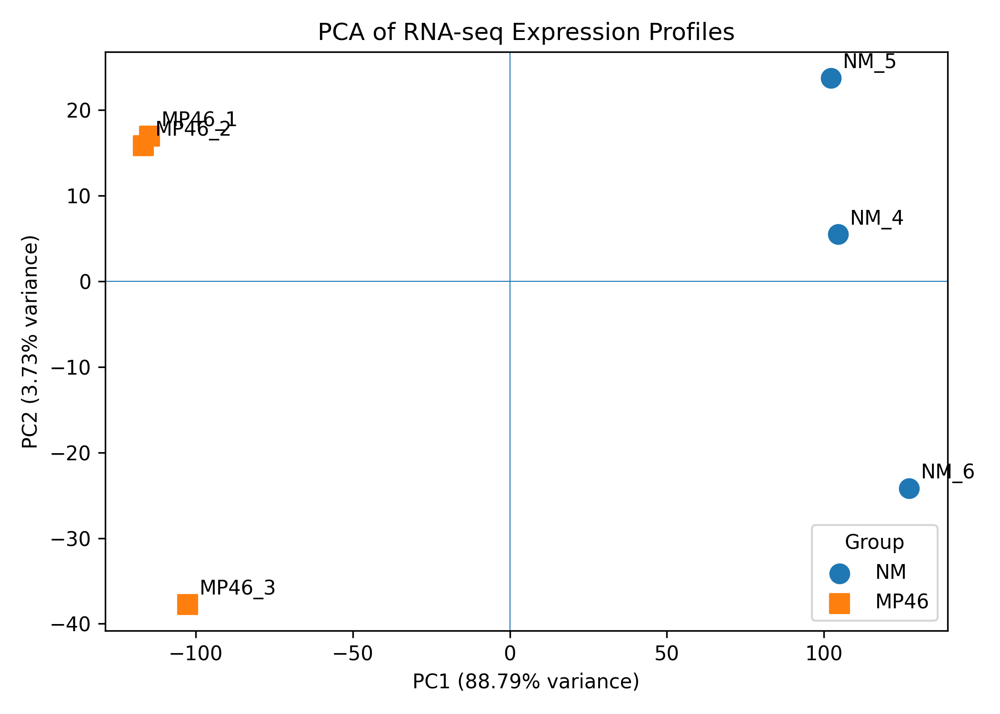

# Expression-Level Quality Control

## Overview

Expression-level quality control was performed after low-expression
filtering to evaluate sample normalization, biological replicate
consistency, group-level expression patterns, and potential outliers
before differential expression analysis.

The workflow was:

```text
Filtered raw counts
        ↓
Median-of-ratios normalization
        ↓
log2(normalized counts + 1)
        ↓
Principal Component Analysis (PCA)
        ↓
Sample-to-sample correlation
        ↓
Differential expression
```

The filtered raw integer count matrix was retained separately for
downstream differential expression analysis.

---

## 1. Expression Normalization

The filtered count matrix contained:

```text
12,728 genes
6 biological samples
```

Samples:

```text
NM_4
NM_5
NM_6
MP46_1
MP46_2
MP46_3
```

Sample-specific size factors were calculated using a
median-of-ratios normalization approach.

| Sample | Size Factor |
|---|---:|
| NM_4 | 1.026 |
| NM_5 | 0.982 |
| NM_6 | 0.837 |
| MP46_1 | 1.023 |
| MP46_2 | 1.089 |
| MP46_3 | 1.134 |

The normalization factors were relatively close to 1, with no extreme
values indicating a major library-composition imbalance.

For exploratory analysis, normalized counts were transformed as:

```text
log2(normalized count + 1)
```

The transformed matrix was used only for exploratory analyses such as
PCA and sample correlation.

Raw integer counts were preserved for count-based differential
expression modeling.

### Script

```text
scripts/downstream/normalize_counts.py
```

### Outputs

```text
gene_counts_normalized.tsv
gene_counts_log2.tsv
normalization_size_factors.tsv
```

---

## 2. Principal Component Analysis

Principal Component Analysis (PCA) was performed on the
log2-normalized expression matrix to evaluate the major sources of
variation among samples.

The first two principal components explained:

```text
PC1: 88.79%
PC2:  3.73%

PC1 + PC2: 92.52%
```

PC1 therefore captured the dominant expression pattern in the dataset.

### PCA Results

| Sample | Group | PC1 | PC2 |
|---|---|---:|---:|
| NM_4 | NM | 104.48 | 5.47 |
| NM_5 | NM | 102.23 | 23.70 |
| NM_6 | NM | 127.15 | -24.19 |
| MP46_1 | MP46 | -114.68 | 16.96 |
| MP46_2 | MP46 | -116.63 | 15.81 |
| MP46_3 | MP46 | -102.54 | -37.75 |

The NM and MP46 samples separated clearly along PC1, indicating that
experimental group was the dominant source of expression variation.

Some within-group variation was visible along PC2, particularly for
`NM_6` and `MP46_3`. However, PC2 accounted for only 3.73% of total
variance, and neither sample shifted toward the opposite group.

No sample was excluded based on PCA.

### PCA Plot



**Interpretation:** PC1 explained 88.79% of total expression variance
and clearly separated NM from MP46, while biological replicates
remained group-specific.

### Scripts

```text
scripts/downstream/pca_analysis.py
scripts/downstream/plot_pca.py
```

### Outputs

```text
pca_coordinates.tsv
pca_expression_qc.png
pca_expression_qc.pdf
```

---

## 3. Sample-to-Sample Correlation

Pearson correlation was calculated between samples using the
log2-normalized expression profiles.

Correlation values close to 1 indicate highly similar genome-wide
expression profiles.

### NM Replicates

```text
NM_4 ↔ NM_5    0.96
NM_4 ↔ NM_6    0.96
NM_5 ↔ NM_6    0.96
```

All NM biological replicates showed high expression similarity.

### MP46 Replicates

```text
MP46_1 ↔ MP46_2    0.98
MP46_1 ↔ MP46_3    0.96
MP46_2 ↔ MP46_3    0.96
```

MP46 biological replicates also showed strong expression similarity.

### Between-Group Correlation

Correlations between NM and MP46 samples were substantially lower:

```text
~0.56–0.64
```

Therefore:

```text
Within NM:        ~0.96
Within MP46:      ~0.96–0.98

NM vs MP46:       ~0.56–0.64
```

This pattern indicates strong within-group reproducibility and distinct
global expression profiles between the two experimental groups.

### Sample Correlation Heatmap


**Interpretation:** Biological replicates showed high within-group
correlation (~0.96–0.98), whereas correlations between NM and MP46
were substantially lower (~0.56–0.64).

### Scripts

```text
scripts/downstream/sample_correlation.py
scripts/downstream/plot_correlation.py
```

### Outputs

```text
sample_correlation.tsv
sample_correlation_heatmap.png
sample_correlation_heatmap.pdf
```

---

## 4. Assessment of Potential Outliers

PCA showed some separation of `NM_6` and `MP46_3` from their respective
replicates along PC2.

However, the correlation analysis showed:

```text
NM_6 vs other NM samples       ≈ 0.96
MP46_3 vs other MP46 samples   ≈ 0.96
```

Both samples therefore remained highly correlated with their respective
biological groups.

There was no expression-level evidence supporting exclusion of either
sample.

All six samples were retained for downstream analysis.

---

## 5. Expression QC Summary

PCA and sample correlation provided complementary evidence of strong
sample-level data quality.

```text
PCA
│
├── PC1 explained 88.79% of variance
├── NM and MP46 clearly separated
└── Replicates remained group-specific
            │
            ↓
Sample Correlation
│
├── NM replicates:   ~0.96
├── MP46 replicates: ~0.96–0.98
└── Between groups:  ~0.56–0.64
            │
            ↓
Expression QC Decision
│
├── Strong replicate consistency
├── Strong experimental group structure
├── No obvious expression-level outlier
└── Retain all six samples
```

The agreement between PCA and correlation analysis supports proceeding
with differential expression analysis.

---

## 6. File Organization

Intermediate analysis files are maintained outside the GitHub
repository under:

```text
~/rnaseq-analysis/GSE199679/counts/
```

These include:

```text
gene_counts_filtered.tsv
gene_counts_normalized.tsv
gene_counts_log2.tsv
normalization_size_factors.tsv
pca_coordinates.tsv
sample_correlation.tsv
```

Final visualization files intended for the portfolio are stored in:

```text
results/expression-qc/
```

GitHub-visible figures:

```text
pca_expression_qc.png
sample_correlation_heatmap.png
```

Large and intermediate analysis files are kept separate from the
repository to maintain a lightweight and reproducible project structure.

---

## 7. Reproducible Scripts

The expression-QC workflow is implemented using:

```text
scripts/downstream/
├── normalize_counts.py
├── pca_analysis.py
├── plot_pca.py
├── sample_correlation.py
└── plot_correlation.py
```

Each script performs a defined step of the analysis rather than relying
on manually generated results.

---

## Next Step

Following successful expression-level QC, the six samples will be used
for differential expression analysis:

```text
NM
vs
MP46
```

Differential expression will use the filtered **raw integer count
matrix**, rather than the log2-normalized matrix used for exploratory
visualization.

```text
Expression QC
      ✓
      ↓
Differential expression
      ↓
Gene annotation
      ↓
Volcano plot
      ↓
Differential-expression heatmap
      ↓
Functional interpretation
      ↓
HTML results report
```