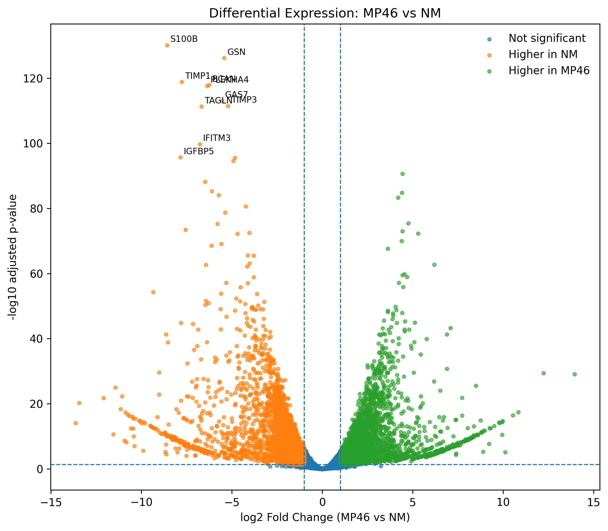
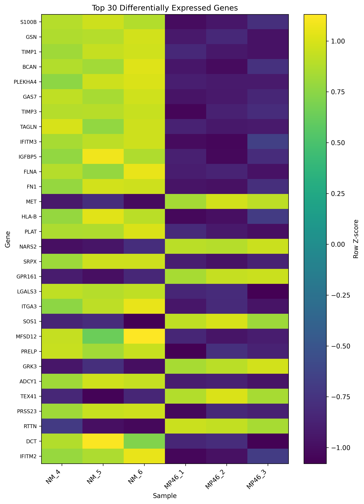

# Differential Expression Analysis

## Overview

Differential expression between **MP46** and **NM** was analyzed using
DESeq2 with three biological replicates per group.

```text
NM:    NM_4, NM_5, NM_6
MP46:  MP46_1, MP46_2, MP46_3
```

The filtered raw integer count matrix containing **12,728 genes** was
used as input.

Normalized or log2-transformed counts from exploratory expression QC
were not used as input to DESeq2.

---

## Analysis Design

The DESeq2 design was:

```text
~ Group
```

with NM defined as the reference group.

The contrast was:

```text
MP46 vs NM
```

Therefore:

```text
log2FoldChange > 0  → higher expression in MP46
log2FoldChange < 0  → higher expression in NM
```

DESeq2 performed count normalization, dispersion estimation,
negative-binomial modeling, and statistical testing.

---

## Significance Criteria

Genes were classified as differentially expressed when:

```text
adjusted p-value < 0.05
AND
|log2FoldChange| >= 1
```

This corresponds to an FDR below 5% and at least a two-fold expression
difference.

---

## Results

A total of **12,728 genes** were tested.

| Criterion | Genes |
|---|---:|
| padj < 0.05 | 8,501 |
| padj < 0.05 and \|log2FC\| ≥ 1 | **6,816** |
| padj < 0.01 and \|log2FC\| ≥ 1 | 6,425 |
| padj < 0.05 and \|log2FC\| ≥ 2 | 3,200 |

Using the primary significance threshold:

```text
Significant DE genes:     6,816
Higher in MP46:           3,495
Higher in NM:             3,321
```

The large number of differentially expressed genes is consistent with
the strong group separation observed during expression-level QC.

---

## Gene Annotation

DESeq2 Ensembl gene identifiers were annotated using the same
**GENCODE v48 GTF** used in the upstream RNA-seq workflow.

```text
Genes annotated:          12,728
Genes with gene symbols:  12,728
Genes without symbols:         0
```

Using the same annotation source throughout the workflow avoids mixing
gene definitions from different annotation releases.

---

## Volcano Plot



The volcano plot summarizes statistical significance and expression
effect size.

```text
Left  → higher in NM
Right → higher in MP46
```

---

## Top Differentially Expressed Genes



The top 30 genes ranked by adjusted p-value showed strong group-specific
expression patterns.

Row-wise Z-scores were used to visualize relative expression of each
gene across samples.

The three NM replicates generally showed similar expression patterns,
as did the three MP46 replicates, supporting the replicate consistency
observed during PCA and sample-correlation analysis.

---

## MA Plot


The MA plot displays log2 fold change relative to mean normalized
expression and provides an additional view of differential-expression
effect sizes across expression abundance.

---

## Reproducible Scripts

```text
scripts/differential-expression/
├── run_deseq2.R
├── annotate_deseq2.py
├── plot_volcano.py
├── plot_de_heatmap.py
└── plot_ma.py
```

---

## Local Analysis Outputs

Full and intermediate results are maintained outside the GitHub
repository under:

```text
~/rnaseq-analysis/GSE199679/results/differential_expression/
```

including:

```text
deseq2_MP46_vs_NM.tsv
deseq2_MP46_vs_NM_significant.tsv
deseq2_MP46_vs_NM_annotated.tsv
```

The repository contains the reproducible scripts, documentation, and
selected final figures rather than large analysis files.

---

## Conclusion

Differential expression analysis identified substantial transcriptional
differences between MP46 and NM.

The results were consistent with the earlier expression QC:

```text
PCA
        ↓
Clear NM / MP46 separation

Sample correlation
        ↓
High within-group similarity

DESeq2
        ↓
6,816 significant DE genes

Top-DE heatmap
        ↓
Group-specific expression patterns
```

All six biological samples were retained throughout the analysis.

---

## Next Step

The next stage will investigate the biological functions represented by
the differentially expressed genes using pathway and functional
enrichment analysis.