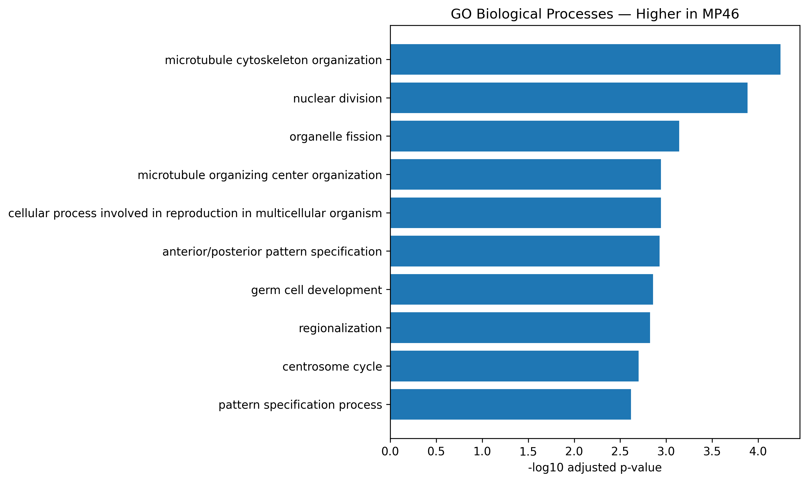
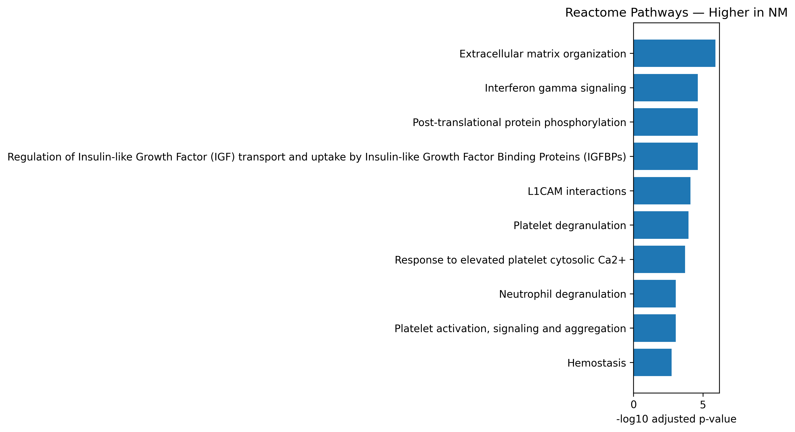

# Functional and Pathway Enrichment Analysis

## Overview

Functional enrichment analysis was performed on differentially expressed
genes from the **MP46 vs NM** comparison.

Significant genes were defined as:

```text
adjusted p-value < 0.05
AND
|log2FoldChange| >= 1
```

Because genes higher in MP46 and genes higher in NM represent opposite
expression patterns, the two sets were analyzed separately.

```text
Higher in MP46: 3,495 genes
Higher in NM:   3,321 genes
Total DE genes: 6,816
```

---

## Analysis Strategy

```text
DESeq2 results
      |
      +-- log2FC >= 1
      |       |
      |       +-- Higher in MP46
      |
      +-- log2FC <= -1
              |
              +-- Higher in NM
```

Each gene set was analyzed independently using:

- Gene Ontology Biological Process (GO BP)
- Reactome pathways

This prevents pathways associated with opposite expression directions
from being combined into a single enrichment result.

---

## Background Gene Universe

The enrichment background consisted of genes tested in the differential
expression analysis rather than all annotated human genes.

```text
DESeq2-tested genes
        ↓
enrichment background
```

Gene symbols were converted to Entrez identifiers before enrichment.

Using the tested-gene universe provides a background that better
represents genes eligible to enter the differential-expression analysis.

---

## Enrichment Method

GO enrichment was performed with `clusterProfiler::enrichGO()`.

Reactome enrichment was performed with
`ReactomePA::enrichPathway()`.

Multiple-testing correction used the
Benjamini-Hochberg method.

Significant terms were defined using an adjusted p-value / q-value
threshold of 0.05.

---

## Enrichment Summary

| Gene set | GO BP | Reactome |
|---|---:|---:|
| Higher in MP46 | 31 terms | 0 pathways |
| Higher in NM | 236 terms | 46 pathways |

The absence of significant Reactome pathways for the MP46-higher gene
set was retained as a valid analysis result rather than relaxing the
statistical threshold.

---

## Genes Higher in MP46

### GO Biological Process



Enriched GO terms among genes higher in MP46 included themes related to:

- nuclear and cell division
- microtubule organization
- centrosome / microtubule-organizing-center processes
- organelle fission
- developmental and patterning processes

These results indicate enrichment of cell-division and
cytoskeleton-associated expression programs among genes with higher
expression in MP46.

### Reactome

No Reactome pathways passed the specified enrichment thresholds for the
MP46-higher gene set.

This negative result was retained and reported rather than changing the
threshold to obtain significant pathways.

---

## Genes Higher in NM

### GO Biological Process


Genes higher in NM showed broader GO enrichment, including themes
related to:

- cell-cell adhesion
- antigen processing and presentation
- extracellular matrix organization
- signaling and cellular interaction processes

Related GO terms may contain overlapping genes because GO is
hierarchical. Therefore, related terms are interpreted as broader
biological themes rather than independent findings.

### Reactome



A total of **46 Reactome pathways** were significantly enriched among
genes higher in NM.

Prominent pathways included:

- extracellular matrix organization
- regulation of IGF transport and uptake by IGFBPs
- interferon-gamma signaling
- platelet activation, signaling and aggregation
- platelet degranulation
- hemostasis
- degradation of the extracellular matrix
- ER-phagosome pathway
- ECM proteoglycans

Extracellular-matrix-related pathways appeared repeatedly, providing
cross-database support for the ECM-associated expression signature
observed in the GO analysis.

---

## Interpretation

GO and Reactome provide complementary views of the differential
expression results.

```text
Higher in MP46
      ↓
cell division
microtubule organization
centrosome-related processes

Higher in NM
      ↓
cell adhesion / extracellular matrix
immune-associated processes
antigen processing / presentation
interferon signaling
```

These results describe pathways and processes **enriched among genes
with higher expression in each group**.

They should not by themselves be interpreted as proof of altered
cellular activity or mechanism. Biological interpretation requires
consideration of the original experimental design and sample metadata.

---

## Reproducible Scripts

```text
scripts/functional-enrichment/
├── create_gene_sets.py
├── run_enrichment.R
└── plot_enrichment.py
```

The workflow separates directional DE gene sets, performs GO and
Reactome enrichment, and generates summary figures.

---

## Local Analysis Outputs

Complete enrichment tables and intermediate results are maintained
outside the GitHub repository under:

```text
~/rnaseq-analysis/GSE199679/results/functional_enrichment/
```

Examples include:

```text
genes_higher_in_MP46.tsv
genes_higher_in_MP46.txt
genes_higher_in_NM.tsv
genes_higher_in_NM.txt

GO_BP_Higher_in_MP46.tsv
GO_BP_Higher_in_NM.tsv

Reactome_Higher_in_MP46.tsv
Reactome_Higher_in_NM.tsv
```

The repository retains reproducible scripts, documentation, and selected
portfolio-ready figures rather than all intermediate analysis outputs.

---

## Conclusion

Direction-specific enrichment revealed distinct functional signatures
between the two expression groups.

Genes higher in MP46 were enriched primarily for cell-division and
microtubule-associated biological processes.

Genes higher in NM showed broader enrichment involving extracellular
matrix and cell-adhesion processes together with immune-associated
pathways.

The enrichment results complement the strong MP46/NM separation
observed by PCA, sample correlation, differential expression, and the
top-DE-gene heatmap.

---

## Next Step

The next stage will integrate the major RNA-seq results into a
collaborator-friendly HTML analysis report containing QC, expression
analysis, differential expression, and functional enrichment results.