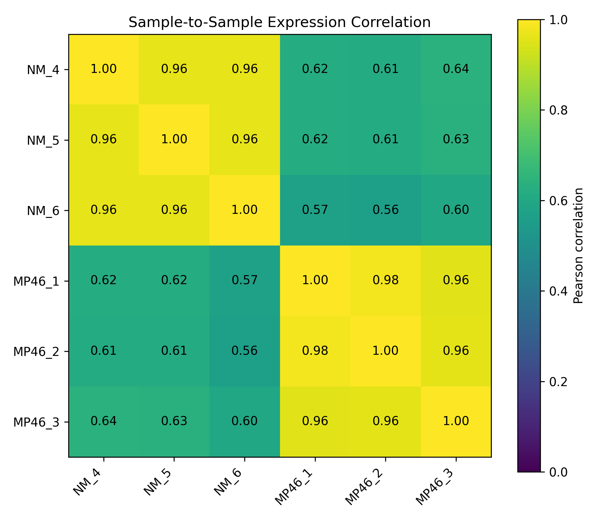
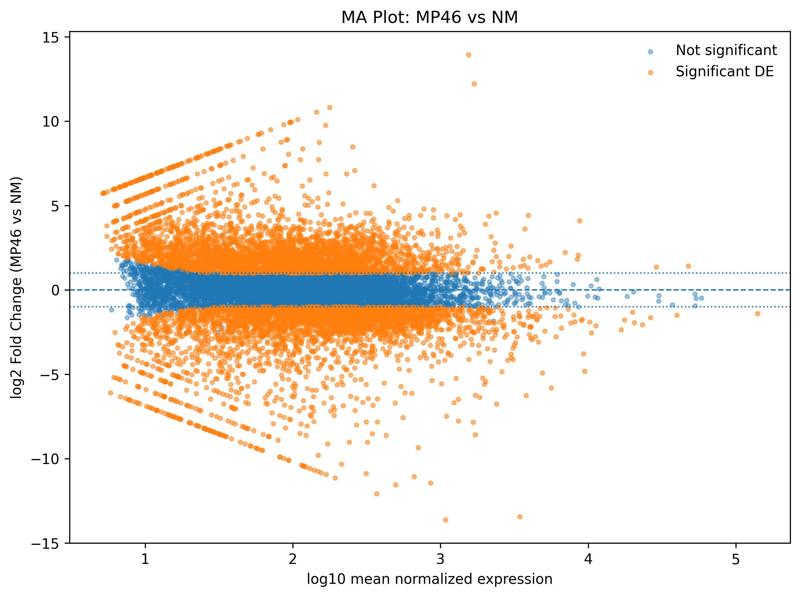
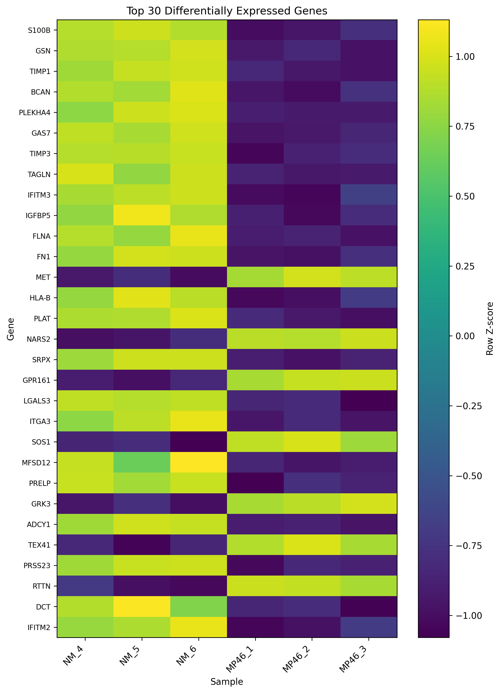
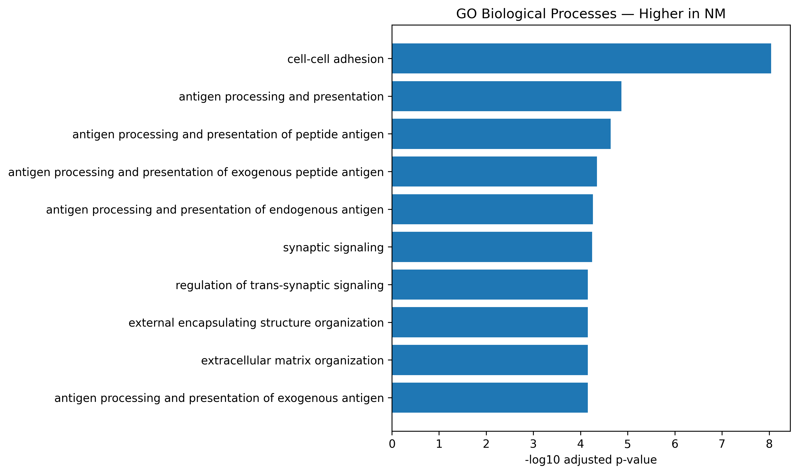

# Analysis Summary

This report summarizes a reproducible bulk RNA-seq analysis comparing
**MP46** and **NM** samples.

The analysis included three biological samples per group:

| Group | Samples |
|---|---|
| NM | NM_4, NM_5, NM_6 |
| MP46 | MP46_1, MP46_2, MP46_3 |

The workflow included sequencing quality control, alignment,
gene-level quantification, expression-level quality control,
differential expression analysis, and functional enrichment.

```text
FASTQ
  ↓
FastQC / MultiQC
  ↓
STAR alignment
  ↓
featureCounts
  ↓
Count QC and filtering
  ↓
Expression QC
  ↓
DESeq2
  ↓
Functional enrichment
```

## Results at a Glance

| Analysis | Key Result |
|---|---|
| Samples | 3 NM + 3 MP46 |
| STAR alignment | 88.3–95.2% uniquely mapped |
| Genes retained after filtering | 12,728 |
| PCA | PC1 = 88.79%; clear NM/MP46 separation |
| Sample correlation | Within-group ≈ 0.96–0.98 |
| Differential expression | 6,816 significant genes |
| Higher in MP46 | 3,495 genes |
| Higher in NM | 3,321 genes |
| GO BP enrichment | 31 MP46 / 236 NM terms |
| Reactome enrichment | 0 MP46 / 46 NM pathways |

**Primary finding:** NM and MP46 show strongly distinct transcriptomic
profiles. Genes higher in MP46 are enriched primarily for cell-division
and microtubule-associated processes, whereas genes higher in NM show
broader enrichment involving extracellular-matrix, cell-adhesion,
immune-associated, and antigen-processing processes.

# Methods Overview

## Reference Genome

RNA-seq reads were aligned to the human **GRCh38 primary assembly**
using **STAR**.

Gene annotation was based on **GENCODE v48**.

The same annotation release was used for:

- STAR genome indexing
- featureCounts gene quantification
- differential-expression gene annotation

## Read Alignment

STAR alignment was performed in a Linux ARM64 Docker environment to
provide a reproducible execution environment on Apple Silicon.

Alignment rates were high overall.

| Sample | Unique Mapping |
|---|---:|
| NM_4 | 95.20% |
| NM_5 | 95.16% |
| NM_6 | 95.11% |
| MP46_1 | 88.29% |
| MP46_2 | 94.31% |
| MP46_3 | 89.23% |

## Gene Quantification

Gene-level counts were generated using **featureCounts**.

The libraries were empirically determined to be reverse-stranded using
RSeQC and were therefore quantified using:

```text
-s 2
```

Assignment rates ranged from approximately **77% to 85%**.

# Count Matrix Processing

The initial featureCounts matrix contained:

```text
78,894 genes
```

Low-expression genes were filtered using the rule:

> Retain genes with at least 10 raw counts in at least 3 samples.

After filtering:

```text
12,728 genes retained
```

The filtered matrix contained:

```text
Duplicate gene IDs: 0
Missing values:     0
Negative counts:    0
```

# Expression-Level QC

## Normalization

Median-of-ratios normalization was used for exploratory expression QC.

| Sample | Size Factor |
|---|---:|
| NM_4 | 1.026 |
| NM_5 | 0.982 |
| NM_6 | 0.837 |
| MP46_1 | 1.023 |
| MP46_2 | 1.089 |
| MP46_3 | 1.134 |

Normalized counts were log2 transformed for PCA and sample-correlation
analysis.

Raw integer counts were retained separately for DESeq2.

## Principal Component Analysis

{fig-alt="PCA showing separation between NM and MP46 samples" width=80%}

PC1 explained **88.79%** of total expression variance and clearly
separated NM from MP46.

PC2 explained an additional **3.73%**.

Together, the first two principal components represented **92.52%**
of expression variation.

## Sample Correlation

{fig-alt="Sample-to-sample Pearson correlation heatmap" width=80%}

Within-group expression correlations were high:

```text
NM:    approximately 0.96
MP46:  approximately 0.96–0.98
```

Between-group correlations were substantially lower:

```text
approximately 0.56–0.64
```

No obvious expression-level outlier was identified, and all six samples
were retained.

# Differential Expression

Differential expression was performed with **DESeq2** using:

```text
Design:   ~ Group
Contrast: MP46 vs NM
```

Therefore:

```text
log2FoldChange > 0  → higher in MP46
log2FoldChange < 0  → higher in NM
```

Significant differential expression was defined as:

```text
adjusted p-value < 0.05
AND
|log2FoldChange| >= 1
```

## Differential Expression Summary

| Result | Genes |
|---|---:|
| Genes tested | 12,728 |
| padj < 0.05 | 8,501 |
| Significant DE genes | **6,816** |
| Higher in MP46 | **3,495** |
| Higher in NM | **3,321** |
| padj < 0.05 and \|log2FC\| ≥ 2 | 3,200 |

## Volcano Plot

{fig-alt="Volcano plot of MP46 versus NM differential expression" width=85%}

The volcano plot demonstrates extensive differential expression in both
directions.

## MA Plot

{fig-alt="MA plot for MP46 versus NM" width=85%}

The MA plot shows differential-expression effect sizes across the range
of mean gene-expression abundance.

## Top Differentially Expressed Genes

{fig-alt="Heatmap of the top 30 differentially expressed genes" width=80%}

The top 30 genes ranked by adjusted p-value showed strong
group-specific expression patterns.

The three NM samples generally showed similar expression profiles, as
did the three MP46 samples.

# Functional Enrichment

Differentially expressed genes were divided by direction before
functional enrichment:

```text
Higher in MP46: 3,495 genes
Higher in NM:   3,321 genes
```

GO Biological Process and Reactome enrichment were performed separately
for the two gene sets.

The enrichment background consisted of genes tested in the DESeq2
analysis.

## Enrichment Summary

| Gene Set | GO Biological Process | Reactome |
|---|---:|---:|
| Higher in MP46 | 31 | 0 |
| Higher in NM | 236 | 46 |

## Genes Higher in MP46

{fig-alt="GO Biological Process enrichment for genes higher in MP46" width=90%}

Prominent enriched themes included:

- nuclear and cell division
- microtubule organization
- centrosome-associated processes
- organelle fission
- developmental and patterning processes

No Reactome pathways passed the specified significance threshold for
the MP46-higher gene set.

## Genes Higher in NM

{fig-alt="GO Biological Process enrichment for genes higher in NM" width=90%}

GO enrichment included:

- cell-cell adhesion
- antigen processing and presentation
- extracellular matrix organization
- cellular signaling and interaction processes

### Reactome

{fig-alt="Reactome pathway enrichment for genes higher in NM" width=90%}

Prominent Reactome themes included:

- extracellular matrix organization
- IGF transport and IGF-binding proteins
- interferon-gamma signaling
- platelet activation and degranulation
- hemostasis
- extracellular matrix degradation
- ER-phagosome pathway
- ECM proteoglycans

# Overall Findings

The independent analysis stages produced a consistent expression-level
pattern.

```text
PCA
  ↓
Strong separation of NM and MP46

Sample correlation
  ↓
High within-group reproducibility

DESeq2
  ↓
6,816 significant DE genes

Functional enrichment
  ↓
Distinct direction-specific biological signatures
```

Genes higher in MP46 were enriched primarily for cell-division and
microtubule-associated processes.

Genes higher in NM showed broader enrichment involving
extracellular-matrix, cell-adhesion, immune-associated, and
antigen-processing pathways.

These enrichment results describe expression-associated biological
signatures and should be interpreted in the context of the original
experimental design.

# Reproducibility

The analysis was implemented using:

- FastQC
- MultiQC
- STAR
- SAMtools
- RSeQC
- featureCounts
- Python
- R / DESeq2
- clusterProfiler
- ReactomePA
- Docker
- Quarto

Validated scripts are maintained in the project repository under:

```text
scripts/
```

Detailed technical documentation is available under:

```text
docs/
```

Large FASTQ, BAM, reference, index, and intermediate count files are
maintained outside the GitHub repository.

# Conclusion

The RNA-seq workflow successfully progressed from raw paired-end
sequencing reads through alignment, quantification, expression QC,
differential expression, and functional enrichment.

Expression-level QC showed strong replicate consistency and clear
separation between NM and MP46.

Differential-expression analysis identified extensive transcriptional
differences between the groups, and direction-specific enrichment
analysis revealed distinct functional signatures.

This report provides a concise collaborator-facing summary, while the
repository contains the scripts and technical documentation required to
reproduce the analysis.
